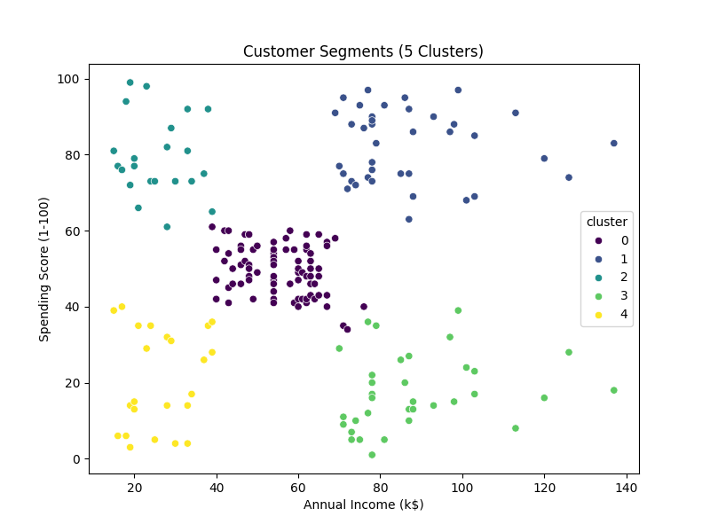

# Customer Segmentation Using KMeans Clustering

This project performs customer segmentation using unsupervised machine learning (KMeans clustering) on a mall customer dataset. The goal is to group customers into segments based on their annual income and spending behavior.

## 📊 Dataset

- Source: Mall Customer Segmentation Dataset
- Features used: `Age`, `Annual Income (k$)`, `Spending Score (1-100)`

# Project Steps

1. Data Exploration: Visualized distributions of age, income, and spending score.
2. Data Preprocessing: Checked for null values and scaled features using StandardScaler.
3. Optimal Clusters: Used the Elbow Method to determine the best number of clusters.
4. KMeans Clustering: Applied clustering and analyzed 5 customer segments.
5. Visualizations:
   - Scatter plot of original data
   - Cluster plot showing the segmented customers

# Sample Plots

# Insights

- Cluster 0: Middle-aged, moderate income, balanced spenders.
- Cluster 1: Young, high income, high spenders.
- Cluster 2: Young, low income, high spenders.
- cluster 3: old, high income, low spenders.
- cluster 4: Old, low income, low spenders.

# Tools Used

- Python (Pandas, Matplotlib, Seaborn, Scikit-learn)
- Jupyter Notebook

# Files

- `customer_segmentation_project.ipynb`: Jupyter notebook with all code and analysis
- `Income_vs_spending_score_scatter_plot.png`, `customer_segments_5_clusters.png`: Visualization files

# Conclusion
This customer segmentation analysis helped identify five distinct groups based on income and spending behavior. These insights can guide targeted marketing strategies, improve customer retention, and enhance business decision-making. The project demonstrates practical application of clustering algorithms in real-world business scenarios.
